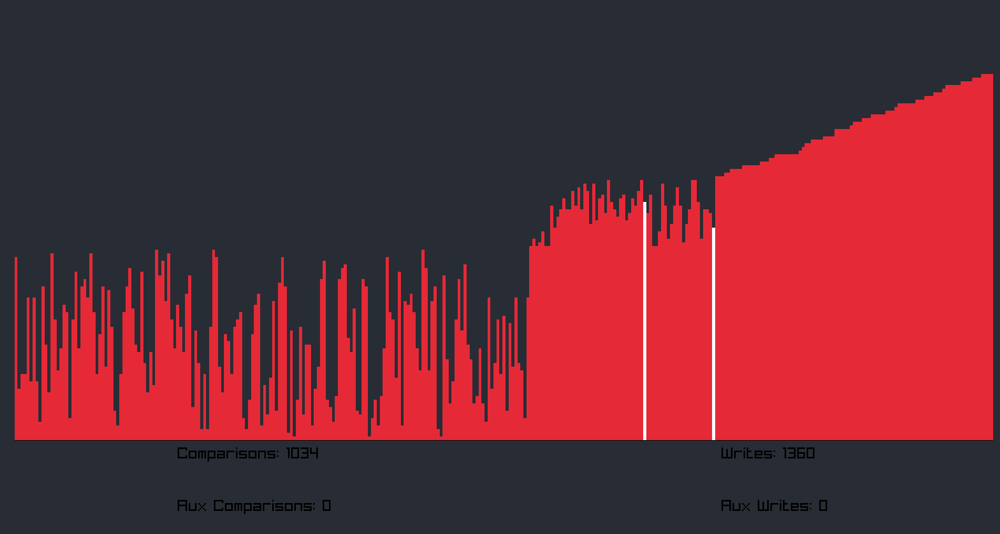

# sortview
A sorting visualizer written in C++ using Raylib.
Currently supports:
* Merge Sort
* Quick Sort
* Selection Sort
* Insertion Sort

Planned to include:
* Nothing! All planned algorithms have been added.

Features:
* Different indicators for reads and writes.
* A menu with selectable algorithms
* Adjustable vector size
* Pre-sorted / Reverse-sorted orientatons

Features not yet added:
* Stat counter (number of swaps/writes/reads/etc)

# Made Using
* Raylib 4.2
* Raylib-Cpp wrapper 4.2
  
# Usage
Either compile the binaries yourself using the provided CMakeLists.txt or download an existing binary release.

Libraries for compiling your own binaries are platform dependent and not included. Instruction for compiling them yourself, and some precompiled ones, can be obtained from Raylib's [official repo](https://github.com/raysan5/raylib).

# Screenshots
* The menu:

* An example sorting algorithm run:

